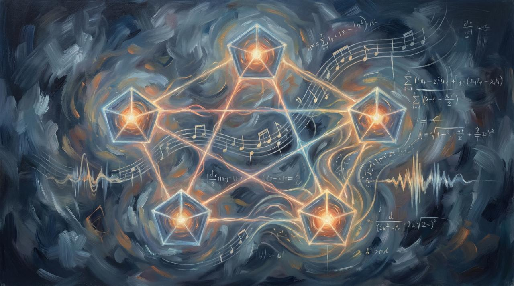

# Chapter 2: Hey Man

Fifteen years is a long time to not talk to someone who changed how you hear music.

I hadn't spoken to David since 2010. Not because of anything dramatic. Not a falling out, not a disagreement, not even a slow fade with a clear cause. Life just did what life does — it moved people to different cities, different careers, different versions of themselves. The band had been over for years by then. The members scattered into lives that looked nothing like Sandersville.

I thought about them sometimes. Not often enough to call. Often enough to notice.

Then on March 4th, a message arrived. No preamble. No catching up first. Just David, sounding exactly like David:

"Hey Man, I've been working with Noah on some ideas. I would love to catch up."

---

I stared at that message longer than it deserved. Six words of substance and they rearranged my week.

Working with Noah. On some ideas. In fifteen years I had built a career in technology, raised a family, written a book about systems and trust, and built a platform for publishing and AI-assisted creation. In that same fifteen years, David had apparently kept doing what David always did — following threads that most people couldn't see yet, pulling Noah along with him, making something in a quiet room that nobody had asked for.

I called him.

---

The conversation started the way conversations start after fifteen years — quick exchanges about health, family, the broad strokes of what happened in the gap. But David doesn't do small talk for long. He never did. Within minutes he was talking about a man named Bennett.

John G. Bennett. Mathematician. Philosopher. Student of Gurdjieff. A man who spent his life trying to answer a question that sounded simple and wasn't: how is the universe structured?

Bennett's answer involved what he called multi-term systems — patterns of relationships that organize reality. Not mystical abstraction. Relational geometry. He believed that the structure of things could be represented through geometric relationships:

A line is a connection. A triangle is tension and reconciliation. A square is stability. A pentagon is creative emergence.

David had been studying this for years. Quietly. The way David does everything — without announcement, without an audience, just deep sustained attention to something that interested him.

And now he was connecting it to music.

---

I listened. And as I listened, something started to happen that I wasn't expecting.

David was describing sacred geometry — the idea that the fundamental structures of the universe express themselves in geometric patterns. Pythagoras heard it in harmonic ratios. Medieval thinkers believed the cosmos itself had musical structure. Islamic architects encoded it in tilework. Philip Glass and Steve Reich built careers on repeating mathematical patterns. Tool wrote albums around Fibonacci sequences.

The idea that music and geometry are expressions of the same underlying order is not new. It is very old. What was new was hearing David describe it — and recognizing the same structures in my own work.

---

My book, Tokenize the World, is about systems of trust. It argues that the world is shifting from records to assertions to tokens to systems of verifiable trust. It describes how reality gets organized through entities, relationships, events, authority, and constraints.

David's framework, drawn from Bennett, describes systems through points, connections, forces, balance, and pattern.

These are the same structure expressed in different languages.

I didn't see that until the phone call. I had written an entire book about how systems organize themselves through relationships and authority, and I had lived inside a band that organized itself through relationships and forces, and I had never connected the two.

David connected them in twenty minutes.

---

And then something else surfaced — something that had been sitting in the first chapter of this book without my realizing it.

I had described the band using physical metaphors. Greg was gravity. David was weather. I was orbit. Rich was a bridge. Noah was tension. Five people, five forces, five points of a geometry I never drew on paper but felt every time we played.

The band wasn't a metaphor for a geometric system. It *was* a geometric system. Five nodes, different forces, music emerging from their interactions. We didn't design it that way. We couldn't have. We just played, and the structure formed because the conditions allowed it.

That's what Bennett would have predicted. That's what sacred geometry describes. Not imposed order — emergent pattern. Structure that arises from the interaction of forces, not from a blueprint.

David heard the geometry in the music. I described it without knowing what I was describing. And now, fifteen years later, we were on the phone discovering that we'd been circling the same idea from opposite directions.

---

The conversation kept going. We talked about Noah, who had been working with David on translating these ideas into something tangible — art, music, story. We talked about the spectrum of expression that David envisioned: the same idea rendered as a song, as a visual piece, as prose, as geometry. Not multimedia for the sake of it. Multimedia because some ideas are too large for a single form.

We talked about what had changed and what hadn't. David still worked the same way — patient, indirect, waiting for the thing to reveal itself. I had changed. I had spent fifteen years building systems, writing about systems, thinking in systems. I had tools now that didn't exist when we were in Sandersville. AI that could generate music from a description. Platforms that could render a chapter into a published book. Image generation that could visualize what words alone couldn't capture.

David had the vision. I had the infrastructure.

Neither of us said it explicitly, but the shape of a collaboration was forming in the space between what he was describing and what I could build.

---

After the call, I sat with it.

Three threads were converging and I could see them clearly now:

My work — systems, trust, structure. The architecture of how things organize.

David's work — Bennett, sacred geometry, the structure of forces. The architecture of how things *emerge*.

The band — five people in a room in Sandersville, accidentally forming a system that both frameworks describe.

The band wasn't just the origin story. It was the proof of concept. A living example of emergent geometric structure, expressed through music, discovered through memory, and only understood decades later when two people who hadn't spoken in fifteen years picked up the phone.

---

I opened my laptop and created a repository. I called it "It Begins, Again."

Because it was beginning again. The same people. The same forces. A different room. Different tools. But the same instinct — five points of a geometry that nobody drew, making something that nobody planned, and discovering the structure only after it had already formed.

The ancient country, it turns out, was never a place.

It was a pattern.

And patterns don't care how long you've been away.
