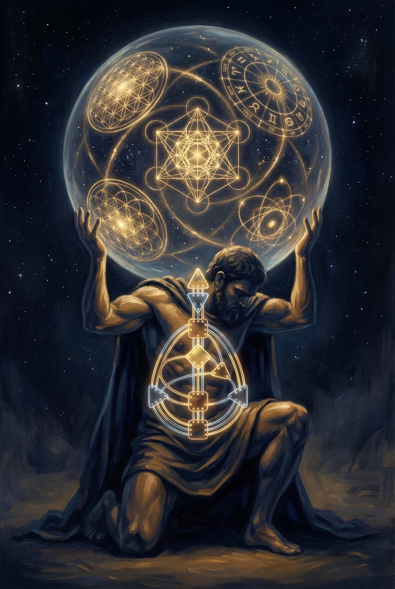

# Chapter 4: The Design

A week after the cloud seeding conversation, David sent me a message. Four words.

"Look into Human Design."

---

I didn't. Not immediately. I was still processing The New Way — Norelli-Bachelet's cosmological framework, the truth-seeds, the Riddle Sleep, form as condensed time. That was dense enough material for one month. And I had a day job. Enterprise architecture doesn't pause because your childhood bandmate is sending you esoteric reading lists.

But the message sat there. And David doesn't send things casually. Everything he recommends has already been tested against whatever internal filter he's been developing for thirty years. If he said look into it, there was a reason. So I looked.

---

Human Design was created by a man named Ra Uru Hu in 1987. The origin story is the kind that would make most enterprise architects close the tab — an eight-day mystical experience on the island of Ibiza, a voice dictating a system for understanding human nature. I almost closed the tab.

But then I read what the system actually was, and I stopped closing the tab.

Human Design is a synthesis. It takes the I Ching's sixty-four hexagrams and maps them to sixty-four codons in human DNA. It takes the Kabbalistic Tree of Life and translates it into a channel system connecting nine energy centers. It incorporates the Hindu-Brahmin chakra system, expands it from seven to nine, and maps those centers onto a diagram of the human body called a bodygraph. It layers in planetary positions at the moment of birth — astrology, but structurally integrated rather than interpreted in isolation.

The result is a chart. Your chart. Nine centers, thirty-six channels, sixty-four gates. Some centers are "defined" — consistent, reliable, generating energy. Some are "open" — receptive, absorbing, conditioned by whatever's around them.

The system categorizes people into five types: Manifestors, Generators, Manifesting Generators, Projectors, and Reflectors. Each type has a different strategy for making decisions. Each has a different relationship to energy, to timing, to authority.

I read all of this in about two hours. Then I sat back and thought about the band.

---

Five members. Five types. I didn't know their charts. I didn't need to. I knew their behavior.

Greg was the center. He didn't push and he didn't pull. He sat behind the kit and everything organized around him. In Human Design terms, he would be a Generator — pure sacral energy, responding to what comes, sustainable and consistent. The engine that doesn't need to be told when to run. You felt Greg's presence before you heard him play. That's a defined Sacral center. Life force that doesn't ask permission.

David was something else entirely. He didn't generate energy the way Greg did. He directed it. He saw where things needed to go before anyone else, and he waited — sometimes for years — until the conditions were right. A Projector, in Human Design language. Someone who sees the system, recognizes the other players, and guides rather than pushes. David never pushed. He waited until he was invited, and then he rearranged the room.

I thought about myself. The systems builder. The one who showed up, plugged in, and worked. Not flashy, not leading, but generating consistently — another form of Sacral energy, maybe, but channeled through structure rather than pure presence. A Manifesting Generator, perhaps. The type that responds and then moves fast, multi-tracking, building while processing, producing output at a rate that sometimes confused even me.

Rich was emotional. Not in the colloquial sense — not dramatic or volatile. Emotional in the way that Human Design describes the Solar Plexus center: operating in waves. Rich's contributions came in cycles. He'd be quiet for stretches, absorbing, processing through some internal rhythm that had nothing to do with the clock. Then he'd surface with something that changed the key of everything we were doing. You couldn't rush Rich. His timing was his own. That's a defined Emotional center — clarity that comes in waves, never in the moment, always after the wave completes.

Noah was pressure. Root energy. The drive that keeps things moving, that creates urgency, that grounds abstraction into action. When Noah played, you felt the floor. Not volume — foundation. The frequency that tells your body this is real, this is happening now, pay attention. Root pressure isn't comfortable. It's necessary. Without it, the rest of us would have floated away into theory and never finished a song.

---

I stared at the bodygraph diagram on my screen and I saw the band.

Five defined centers. Five people. The channels between them — the thirty-six possible connections — were the musical relationships we'd discovered in that room in Sandersville without knowing what we were discovering. Greg to David was the channel between Sacral response and Projector guidance. David to Rich was the channel between recognition and emotional depth. Noah to everyone was the Root pressure that kept the whole system honest.

And the four open centers — Head, Ajna, Spleen, Heart — were what the band absorbed from outside itself. We were open to inspiration without owning it. Open to intuition without controlling it. Open to willpower without forcing it. The open centers were our receptivity. The thing that made us sound different every night even when we played the same songs.

I called David.

"You see it," he said. It wasn't a question.

---

What I saw was this: every framework David had sent me — Bennett's systematics, Norelli-Bachelet's condensation of time, and now Human Design — was describing the same architecture from a different angle. Bennett used geometric relationships. Norelli-Bachelet used cosmological cycles. Ra Uru Hu used a bodygraph. Different languages. Same structure.

A system of defined and undefined centers. Channels that carry energy between them. Types that describe how each node relates to the whole. Forces that are consistent and forces that are receptive. A geometry that isn't imposed but emergent — arising from the specific configuration of the parts.

The band wasn't a metaphor for any of these systems. It was an instance of all of them. Five people in a room, each with defined energies and open spaces, connected by channels they never drew on paper, producing something that none of them could produce alone. The music was what happened in the channels. The silence between notes was what happened in the open centers.

---

I thought about Atlas. The image that had been forming since the first phone call — a figure bearing the weight of something vast, not because he chose to but because the structure of his body allowed it. The bodygraph as skeleton. Not the muscle or the will but the architecture. The hidden design that makes it possible to hold a universe of sacred geometry without collapsing under its weight.

That's what the band was. Not five strong individuals carrying something heavy through sheer effort. Five specifically configured energy systems whose defined centers and open spaces created the exact architecture needed to hold the music. Take any one away and the structure fails. Not because the music gets quieter. Because a center goes dark and the channels that depend on it lose their flow.

Atlas doesn't hold the world because he's strong. He holds it because he's designed to.

---

David had known this for years. Quietly. The way David knows everything — through sustained attention, through patience, through the refusal to announce a conclusion before it's been lived. He'd studied Bennett, then Norelli-Bachelet, then Human Design, then whatever came next, always circling the same truth from different angles, never pinning it down with a single framework because the truth was bigger than any one system.

And now he was handing the pieces to me. Not to explain them — David doesn't explain. He places things in front of you and waits for you to see the pattern.

The pattern I saw was this: we weren't just reconnecting as old friends who used to play music. We were rediscovering a design that had always been there — in the band, in the music, in the geometry of how five specific people relate to each other and to the creative force that moves through them.

The fifteen-year gap wasn't a gap. It was an open center. Receptive. Absorbing. Waiting for the right energy to define it.

And now it was defining itself.
