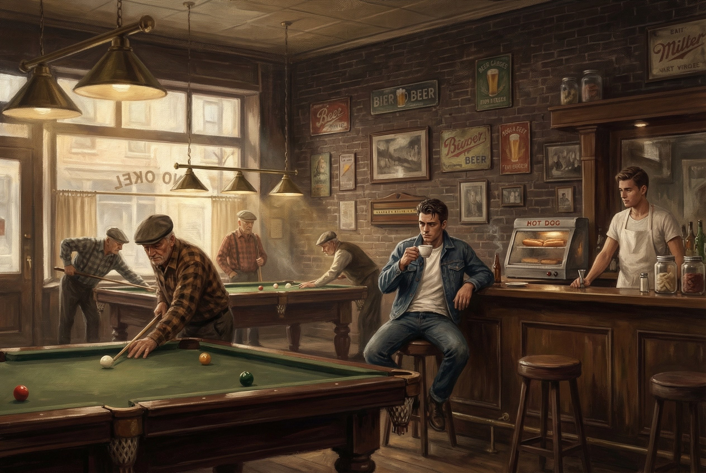

# Chapter 5: The Pool Hall

The first place I went in Milledgeville was a pool hall.

Not a bar. Not a dorm party. Not orientation or a campus tour or any of the things a normal nineteen-year-old does when they show up to college for the first time. I walked down Hancock Street in the middle of a Georgia summer, knowing absolutely nobody, and pushed open the door to a place called DoDo's.

I don't remember why. I've tried to reconstruct the logic of it — a nineteen-year-old who'd never shot a game of snooker in his life, walking into a room full of old men on a Tuesday afternoon — and I can't find the reason. Maybe there wasn't one. Maybe I just needed to be somewhere that wasn't my dorm room, and the door was open, and the air conditioning was on, and it was a hundred degrees outside with the kind of Georgia humidity that makes you feel like you're breathing through a wet towel.

I was from Marietta. Cobb County. The suburban sprawl version of Georgia, where the South had been paved over so completely you'd never know it was there. Strip malls and subdivisions and highways that all look the same. A place that's technically Georgia but could be anywhere — the suburbs of Charlotte or Dallas or any other Sun Belt city that grew too fast and forgot what it was growing on top of.

Marietta in the late eighties had no architecture. No history you could feel. Just growth. New construction on top of red clay, fast food chains replacing whatever had been there before, a population that had mostly come from somewhere else and brought nothing with them except the need for a good school district and a Kroger within driving distance. The most dangerous thing in Marietta was boredom, and even that had been safely contained by the presence of a mall.

I was nineteen, not eighteen. There's a year in there that I'm not going to account for in this chapter. A year between graduating high school and arriving at college where things had gone badly enough that starting over wasn't a choice — it was the only option left. The specifics will come later, if they come at all. What matters for this part of the story is the result: I arrived in Milledgeville a year behind, carrying the kind of weight that a nineteen-year-old shouldn't have to carry and can't explain to anyone without sounding like he's asking for something he doesn't want to ask for. Sympathy, maybe. Or permission to be lost.

I came to Milledgeville because it was far enough away. Not from Georgia — from that version of Georgia. From the version of myself that Marietta had produced. The distance from Marietta to Milledgeville is about a hundred miles on the map. In terms of what kind of place it is, it's another century.

Milledgeville still carried its past. You could feel it the moment you turned off the highway — the oaks getting older, the buildings getting lower, the air getting thicker with something that wasn't just humidity. Old money and older secrets sitting behind columns that had been white for a hundred and fifty years. Eccentrics who held more power than the people in suits. Beauty draped over darkness the way Spanish moss hangs on a live oak — decorative until you realize it's slowly pulling the tree apart. The town operated by its own rules, and nobody was going to explain them to you. You either figured it out by staying long enough, or you left and never understood what you'd been standing in.

I didn't understand any of this at eighteen. I just knew the town felt different from Marietta. From anything I'd experienced. Heavier. Older. Like it knew something I didn't and wasn't in any hurry to tell me.

---

The thing you have to understand about Milledgeville in 1989 is that there was nothing there.

I don't mean that in the way people mean it when they're being dramatic about small towns. I mean it literally. The strip that would later define my twenties — Cameron's, the Brick, Brewers, the whole geography I described in the first chapter — none of it existed yet. Those places would be built over the next four or five years, mostly by people my age who stuck around after college and decided to make something instead of leaving.

In 1989, if you went to Georgia College and you wanted to go out, you went to the Opera House. That was it. One bar. DoDo owned it. Thursday nights, the entire student population funneled into a single room because there was no other room to funnel into.

I learned this from a girl in my first class. Eight in the morning, summer session, and she leaned over before the professor started and said, "Thursday nights, the Opera House." Like she was handing me directions to church. That was the whole social orientation. One sentence. One venue. One night of the week.

But I didn't start at the Opera House. I started at the pool hall next door.

---

DoDo's Pool Room sat at 128 West Hancock Street. The Opera House was right beside it at 124. Same owner, same block, adjacent doors. If you stood on the sidewalk, you could look left and see the pool hall, look right and see the bar, and that was DoDo's empire. Two buildings. One man's grip on everything that happened on that stretch of road.

DoDo was James Hollis. I don't think I ever heard anyone call him James. He was DoDo, and he owned the rooms and the liquor store that supplied them, and if you spent time on Hancock Street in any decade between the seventies and the twenty-tens, you passed through something he controlled. Not because he was ambitious. Because he was there first, and he stayed.

The pool hall itself was not what you'd expect from a college town. There was no neon. No sticky floors. No jukebox playing Nirvana because it was 1989 and Nirvana hadn't happened yet and even when they did, this room wouldn't have cared.

Wood floors. Dark, scarred wood that creaked when you stepped wrong and had probably been creaking since the Eisenhower administration. Brick walls. Professional snooker tables — full-size, not the coin-operated bar tables I'd seen at pizza joints back home. These were serious pieces of furniture. Green felt stretched tight, clean rails, the kind of tables where the balls rolled true and the men who played on them knew the difference.

The light came from hanging brass lamps over each table, the old-fashioned kind with green glass shades. During the day, some light leaked in through the front windows, but mostly the room existed in its own atmosphere. Dark enough to feel like a cave, bright enough to see the angles. The rest of the place was shadow and antique junk on the walls — old signs, maybe a clock that may or may not have worked, the kind of decorating that happens when nobody decorates and forty years of accumulated objects just become the room.

There was a bar along one wall. Not a cocktail bar. A counter. A lunch counter, really. And on that counter sat a hot dog warmer — the rotating kind, with the metal rollers, the kind you see at gas stations. Hot dogs for a dollar. That was the food program.

---

The men who played there were not college students. They were locals. Old guys from Milledgeville who had been shooting snooker in that room since before I was born and would continue shooting snooker in that room long after I graduated and left and forgot about them entirely, which I did, for decades, until right now.

They didn't look up when I walked in. I was another kid from the school up the hill. They'd seen a thousand of me. I didn't play. I didn't know how to play, not on those tables, not in that company. These guys played snooker — not eight-ball, not nine-ball, not the game you play at your buddy's house after three beers. Snooker. The quiet game. The one where the balls are smaller and the table is bigger and the geometry actually matters. They moved around those tables like they were doing something they'd been doing every day for forty years, which they probably had. Deliberate. Patient. No trash talk, no celebration after a good shot. Just a nod, maybe, and the next setup.

I sat at the counter.

There were no women in DoDo's pool hall. Not during the day. I don't know about nights, but I doubt it. This wasn't a place that excluded anyone on purpose. It just didn't occur to anyone to come here unless you wanted to shoot snooker or eat a hot dog or sit in a room where nobody expected anything from you. The men who came here had been coming here. That was their credential. Not youth, not money, not charm. Repetition. You earned your place by showing up enough times that your absence would be observed.

I hadn't earned anything yet. I was just a kid on a stool, watching a room that had no interest in being watched.

---

Roger was behind the counter.

He was maybe twenty-two. A math and computer science student at the college, which made him the youngest person in the building by a wide margin, except for me. He had a way of talking that made you feel like you'd interrupted a thought he'd been developing for hours, and maybe you had. Roger didn't make small talk. He made observations. He noticed things. He'd comment on the weather or the snooker game happening behind you or the hot dog you were eating, and each comment had a precision to it, like he'd considered several options and chosen the one that was most accurate.

He served me a hot dog. A dollar. I sat there and ate it and he talked to me because that's what Roger did — he talked to whoever sat at the bar. The old men didn't sit at the bar. They played. So the bar was Roger's territory, and if you sat in it, you were his audience.

He was trying to beat the Georgia Lottery.

Not playing it. Beating it. He had a system. Numbers, patterns, frequency analysis — the kind of thing that sounds reasonable when a math major explains it and sounds insane when anyone else does. He'd been tracking drawings, building models, looking for the signal in the noise. This was 1989. There was no internet. There was no data science. There were spiral notebooks and a TI calculator and a twenty-two-year-old kid behind a lunch counter in a pool hall in Milledgeville, Georgia, who believed that randomness was a solvable problem.

I didn't believe him. I didn't need to. Belief wasn't the point. The point was that Roger took the thing seriously. He wasn't playing the lottery the way the old guys in line at the gas station played it — picking birthdays, rubbing coins on scratch-offs, praying to whatever saint handles gambling. He was *working* it. Like a job. Like a thesis project that happened to take place behind a lunch counter in a pool hall instead of in a lab.

He was the most interesting person I'd met since arriving in town, which wasn't saying much because I hadn't met anyone, but it was also saying everything because Roger was genuinely interesting. He was smarter than the bar he was standing behind. You could feel it — the mismatch between the setting and the mind. A guy running probability models while serving dollar hot dogs to snooker players who wouldn't know a standard deviation from a bank shot. He didn't seem bitter about it. He didn't seem like he was waiting for something better. He was just *there*, doing his math, making his conversation, keeping the hot dogs rolling.

Years later, I'd meet a lot of people like Roger. People whose minds didn't match their zip codes. People doing extraordinary thinking in ordinary rooms. But he was the first one, and you never forget the first one, because until you meet them you think intelligence requires a stage.

I came back the next day. And the day after that.

---

Here's what I think I was doing, though I didn't have the language for it then.

I was nineteen years old and I had arrived at college knowing nobody. Not "I didn't know many people" — I knew *nobody*. No friends from high school tagging along. No family connections to the town. No girlfriend, no roommate I'd met at orientation, no older cousin who could show me around. I had a dorm room in a building that smelled like industrial cleaner and a class schedule that started at eight in the morning and a town I'd never visited before the day I moved in.

Most kids show up to college with at least a thread — a hometown friend, a connection from summer camp, someone from church. I had no threads. Whatever I'd had in Marietta, I'd either lost or cut during the year I'm not talking about. The distance from Marietta to Milledgeville wasn't just geographical. It was a reset. I needed to be somewhere where nobody knew me, which also meant being somewhere where I knew nobody, and in the summer of 1989 I was learning what that actually felt like on the ground, in the heat, alone.

Walking through Milledgeville that first week was like walking through a town that was simultaneously beautiful and indifferent. Old houses with columns and wraparound porches sitting next to vacant lots. A main street that could have been a movie set if anyone had bothered to light it. People who nodded at you and meant it — Southern hospitality isn't a myth, it's a practice — but who also didn't need you, didn't notice if you came or went, didn't track your presence the way a small town in a movie would. Milledgeville was too old and too tired to care about one more kid from Cobb County.

The pool hall didn't ask me to be anyone. It didn't ask me to pledge anything or join anything or pretend I belonged. The old men didn't care. Roger didn't care — or rather, Roger cared about math and hot dogs and the lottery, and whether I was cool or connected or lost was irrelevant to anything that mattered in that room.

I could just sit there. Eat a hot dog. Listen to Roger talk about prime number distributions. Watch the old men play their quiet, serious game. Feel the wood floor vibrate slightly when someone broke a new rack. Smell the smoke and the mustard and the old brick that had been absorbing summers since before air conditioning.

For a kid with no footing, a place where sitting is enough is everything. I didn't know that then. I just knew I kept going back.

---

That became the rhythm. Class in the morning, pool hall in the afternoon. The rest of the week was dead time — walking the campus, eating in the cafeteria alone, reading whatever I could find in the library. Milledgeville in the summer was a skeleton town. Half the students were gone. The ones who remained were there for the same reason I was, which was that they didn't have anywhere better to be, or couldn't afford to wait until fall, or had their own version of the story I'm not telling yet.

The town itself was small in the way that central Georgia towns are small — not quaint, not charming, just small. Two colleges and a main street and a Walmart and churches and the kind of heat that makes the asphalt shimmer at two in the afternoon. You could drive from one end to the other in five minutes. Everybody you saw, you'd see again. The world was compressed.

But Milledgeville had something underneath the smallness. An architecture. Not the kind you study in school — the kind you absorb by walking past it every day until it gets into your bones. Antebellum columns on houses that had no business being that beautiful in a town that size. The Old Governor's Mansion. The brick facades downtown that looked like they'd been standing since before the Civil War because some of them had. Georgia's old capital, before Atlanta took over, and the buildings still carried that weight — the sense that something important had happened here once and the town was still deciding whether to be proud of it or embarrassed by it.

There was a farm just outside of town where a woman had raised peacocks and written stories about misfits and grace and the violence that hides inside good manners. She'd gone to the same college I went to, back when it had a different name. She died there in 1964, twenty-five years before I showed up. I didn't know any of this when I arrived. I learned it the way you learn everything in Milledgeville — slowly, through repetition, through the landscape itself. Nobody advertised it. The town just was the kind of place that could produce that work — the grotesque living comfortably inside the ordinary, the weight of salvation pressing down on people who hadn't asked for it.

I didn't read those stories until later, but I felt them. The pool hall was one of her settings. Roger was one of her characters — the misfit genius in a room that didn't require genius. DoDo was one of her characters — the man who owned everything and was known only by a nickname that sounded like a children's song. The old men shooting snooker in the permanent twilight of a room that time had forgotten. Ordinary people in an ordinary place, and if you looked too hard, something underneath that you weren't ready for.

I think that compression is what made the strip possible, later. When Scott Cameron opened his bar across the street, and Mitch Brooks opened the Brick, and somebody opened Brewers — when all of that happened over the next few years — it worked because the town was small enough that one bar could change the entire social physics. In a city, a new bar is nothing. In Milledgeville, a new bar was an event. A new room meant a new crowd meant new possibilities. And the people who opened those rooms were my age, which meant the scene wasn't something I found. It was something that assembled around me while I was busy being lost.

But all of that came later. In 1989, it was just DoDo's world. The pool hall next door to the one bar in town. Two rooms. One man. A kid at the counter eating a hot dog.

---

I think about the pool hall now the way you think about a first apartment, or the first car you drove that actually ran. Not with any illusion that it was special, but with the clarity that it was *first*. Everything that came later — the strip, the bands, the people, all of it — rested on the fact that I stayed. And I stayed partly because of that room.

It wasn't a scene. It wasn't a moment. It was a counter and a hot dog and a kid behind it who was too smart for where he was and didn't seem to mind. And for a few weeks in the summer of 1989, that was enough to keep me from getting in my car and driving home.

---

The pool hall is gone now. The building is still there — 128 West Hancock — but it's called Black Sheep, and it's a barcade with arcade games and cornhole and things that would've made the old snooker players walk out and never come back. DoDo died in 2016. The Opera House next door became an Asian restaurant and then something else and then something else. The Brick's owner bought both buildings. The strip that my generation built got consolidated back into fewer hands, the way things always do.

Roger, I assume, never beat the lottery. I lost touch with him the way you lose touch with everyone from that period — not dramatically, not with a fight, but because life moved and I moved with it and the pool hall stayed where it was. I don't know where he ended up. I hope the math took him somewhere good. I hope he's running numbers on something that pays better than scratch-offs. I hope he knows that somebody remembers him — not for the algorithm, but for the conversation, for the counter, for being the first person in a new town who treated me like I was worth talking to.

---

I'm looking at a photograph on social media as I write this. A mutual friend posted it — someone who knows both me and Greg, our drummer, the one from Sandersville. The picture is of Milledgeville. I don't even remember what's in it specifically. A building, a street, the kind of shot someone takes because the light was good and the town looked the way they remembered it. What matters is that I saw it, and Greg would have seen it, and somewhere in that overlap is the thing I'm trying to get at.

Greg and I shared something that none of the other guys in the band shared with me. An appreciation for the gothic architecture of the antebellum South. Not in an academic way — neither of us was an architecture student. In a *feeling* way. The columns, the porticos, the way those old houses sit on their land like they're daring you to knock them down. The scale of them in a town that small. The absurdity and the beauty coexisting in the same structure, the way a plantation house can be simultaneously the most gorgeous thing you've ever seen and a monument to something unforgivable. Greg understood that tension. He didn't talk about it much. He didn't talk about much. But you could feel it in the way he moved through those spaces — with a reverence that had nothing to do with nostalgia and everything to do with weight. The weight of a place that carries its history in its walls.

Milledgeville was built for that feeling. The Old Governor's Mansion. The Federal-style houses on the side streets. The brick facades downtown that looked like they'd been standing since before Sherman and had — because Sherman didn't burn Milledgeville, not the way he burned Atlanta. He passed through. The town survived, and its architecture survived, and that survival gave the place a density that newer towns don't have. You could feel the accumulation. Layer on layer of people and decisions and buildings that outlasted the people who built them.

O'Connor felt it. Greg felt it. I felt it. The pool hall was part of it — not because the building was beautiful, but because it was *old* in the right way. Old without trying. Old because nobody had bothered to make it new.

I haven't heard from Greg yet. David and Rich and I have been circling this reunion of ideas — the conversations, the music, the frameworks, all of it coming back together after decades. But Greg is quiet. Greg was always quiet. He was the center of gravity in the band, and the center of gravity doesn't announce itself. It just holds.

I don't know how he sees this. I don't know if he wants to see it. People move on in different ways, and some of them move on by not looking back, and that's their right. I won't push. But I look at that photograph — the light on the old brick, the street I walked when I was nineteen and lost — and I think about Greg standing in the same town, feeling the same architecture, hearing the same silence between the notes. And I wonder if he remembers it the way I do. If the weight of the place is still in him the way it's still in me.

---

In the summer of 1989, I sat in a room that smelled like hot dogs and old wood and cigarette smoke, surrounded by men who had nothing to say to me, and felt for the first time like I might survive this town. Not thrive. Not belong. Survive. And survival, at nineteen, in a place where you know nobody, is the whole game.

Everything else — the bands, the music, the friends, the reasons I'm writing this now — came later. But it started on a stool at DoDo's, watching Roger count his numbers, listening to snooker balls crack on the green felt, eating a hot dog that cost a dollar and was worth exactly that.

The pool hall didn't teach me anything. It just let me sit still long enough to figure out that I wasn't leaving.

That was enough.
